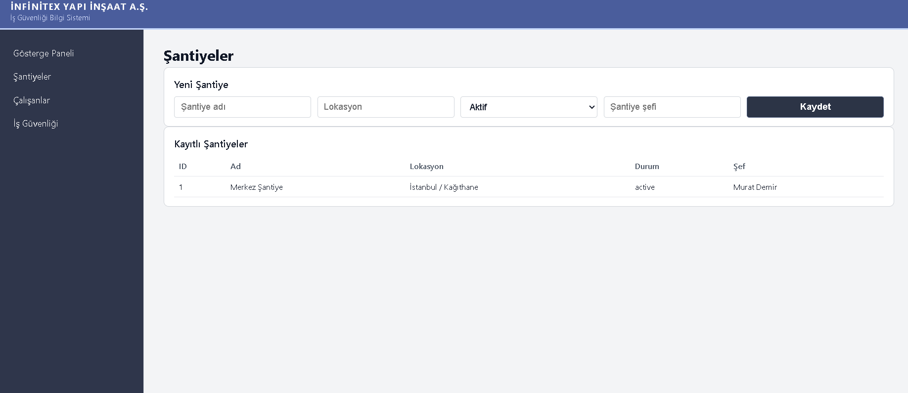
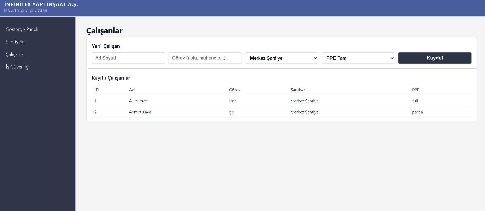
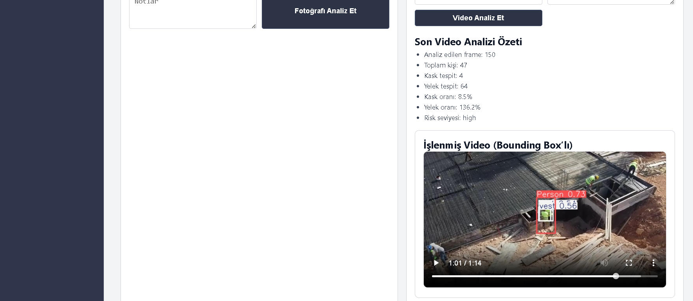
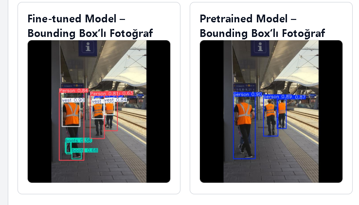
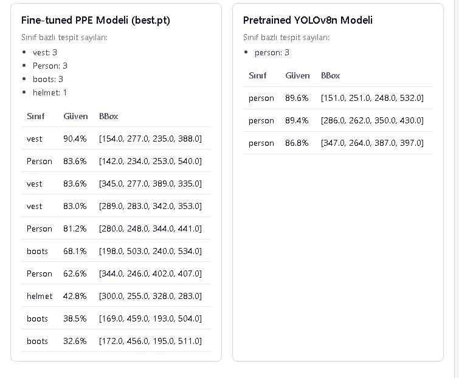

# İNFİNİTEX YAPI iNŞAAT A.Ş – İş Güvenliği Bilgi Sistemi

Bu proje, **inşaat şantiyelerinde iş güvenliği denetimlerini** merkezi bir panel üzerinden yönetmek için geliştirilmiş, web tabanlı bir **İş Güvenliği Bilgi Sistemi**dir.  

Sistem, hem klasik **form tabanlı yönetim** (şantiye, çalışan, denetim kayıtları) hem de **YOLOv8 tabanlı PPE (Personal Protective Equipment) tespiti** ile çalışan **görüntü analizi modülünü** birleştirir.

> Not: Uygulama tarafında kullanılan asıl model, **ilk fine-tuned `best.pt`** dosyasıdır.  
> Aşağıda anlatılan “ek eğitim” deneyi sadece araştırma amaçlıdır ve **üretim koduna entegre edilmemiştir.**


> Temel amaç:  
> - İnşaat şirketi için kurumsal bir iş güvenliği paneli tasarlamak  
> - Aynı zamanda **pretrained YOLOv8** ile **PPE veri setiyle fine-tune edilmiş YOLOv8** sonuçlarını **aynı arayüzde kıyaslamak**  
> - Bu kıyas üzerinden transfer öğrenme ve CNN yapısını somut bir örnekle açıklamak

## Video 

[▶️ Videoyu İzle](https://github.com/user-attachments/assets/4e2d7af1-d6b4-434b-907f-79dc26b7f8f2)

---

## 1. Genel Bakış

Sistem üç ana modülden oluşur:

1. **Yönetim Modülü**
   - Şantiye kayıtları
   - Çalışan kayıtları
   - Denetim geçmişi

2. **AI Destekli İş Güvenliği Modülü**
   - Fotoğraf üzerinden **PPE tespiti** (kask, yelek, eldiven, gözlük, bot, vs.)
   - Video üzerinden **frame bazlı PPE oranı analizi** ve otomatik risk seviyesi
   - **Pretrained YOLOv8n** ile **fine-tuned PPE modeli** sonuçlarını yan yana gösteren karşılaştırma tablosu

3. **Risk Analizi Modülü**
   - Her denetim için risk seviyesi (low / medium / high)
   - Tüm denetimlerden **toplam risk özeti**
   - Her şantiye için ayrı **ortalama risk skoru** ve “Düşük / Orta / Yüksek” risk etiketi

---

## 2. Kullanılan Teknolojiler

- **Backend**
  - Python 3.9
  - FastAPI
  - Uvicorn
  - Jinja2 (templating)
  - Pydantic (şema/model)

- **Görüntü İşleme / DL**
  - Ultralytics YOLOv8
  - PyTorch
  - OpenCV (video analizi)

- **Frontend**
  - HTML + Jinja2 templating
  - Custom CSS (kurumsal / devlet kurumu teması)

---

## 3. Sistem Mimarisi

Proje, **katmanlı ve nesne yönelimli (OOP)** bir mimariyle kuruldu.

### 3.1. Klasör Yapısı (Özet)

```bash
app/
├── api/
│   └── routes.py            # FastAPI endpoint'leri
├── core/
│   └── config.py            # Ayarlar, UPLOAD_DIR vb.
├── models/
│   ├── site_model.py        # Şantiye domain modeli
│   ├── worker_model.py      # Çalışan domain modeli
│   └── inspection_model.py  # Denetim domain modeli
├── services/
│   ├── site_service.py      # Şantiye CRUD ve iş mantığı
│   ├── worker_service.py    # Çalışan CRUD ve iş mantığı
│   ├── safety_service.py    # Denetim ve risk analizi
│   └── yolo_ppe_service.py  # YOLOv8 PPE + karşılaştırma servisi
├── static/
│   └── style.css            # Kurumsal devlet temalı CSS
├── templates/
│   ├── layout.html          # Ortak layout (topbar + sidebar)
│   ├── dashboard.html       # Gösterge paneli
│   ├── sites.html           # Şantiye sayfası
│   ├── workers.html         # Çalışan sayfası
│   └── safety.html          # İş güvenliği + model karşılaştırma
└── main.py  

```

# FastAPI uygulama başlangıcı
# 2. Servisler

## 2.1. SiteService

### İşlevler
- Yeni şantiye oluşturma  
- Şantiyeleri listeleme  
- ID’ye göre şantiye bulma  

### Alanlar
- **id**
- **name**
- **location**
- **status**
- **supervisor**

---

## 2.2. WorkerService

### İşlevler
- Çalışan ekleme  
- Çalışanları listeleme  
- Şantiyeye göre filtreleme  

### Alanlar
- **id**
- **name**
- **role**
- **site_id**
- **ppe_status** (örn. *tam*, *eksik*, *bilinmiyor*)

---

## 2.3. SafetyService

### 2.3.1. Denetim kaydı
Aşağıdaki alanlarla bir **inspection** kaydı oluşturur:
- **site** (şantiye objesi)  
- **inspector** (denetçi adı)  
- **risk_level** (low, medium, high)  
- **notes**  
- **file_name** (analiz edilen foto/video dosyası)  
- **detected_ppe** (PPE sınıfları listesi)

---

### 2.3.2. Genel risk özeti
Tüm denetimler üzerinden:
- Toplam denetim sayısı  
- Low / Medium / High sayıları  
- Oranlar  

---

### 2.3.3. Şantiye bazlı risk analizi

Her şantiye için risk ağırlıkları:
- **low = 1**
- **medium = 2**
- **high = 3**

**Ortalama skor:**
```bash
\[
risk\_score = \frac{\sum risk\_weight}{denetim\ sayısı}
\]
```
**Skor etiketlemesi:**
- `< 1.5` → **Düşük risk**  
- `< 2.5` → **Orta risk**  
- `>= 2.5` → **Yüksek risk**

Bu analiz Dashboard’da şantiye bazlı tabloda gösterilir.

---

## 2.4. YoloPPEService

Hem **fine-tuned PPE modeli (best.pt)** hem de **pretrained YOLOv8n (yolov8n.pt)** aynı anda yüklenir.

### Ortak yardımcı fonksiyon
`_analyze_with_model(model, image_path) -> List[Detection]`

Her bir tespit için:
- **class_id**
- **class_name**
- **confidence**
- **bbox = [x1, y1, x2, y2]**

---

### 2.4.1. analyze_image_compare(image_path)

Döndürdüğü yapı:

```json
{
  "fine_tuned": {
    "detections": [...],
    "counts": { "helmet": 3, "vest": 5, ... }
  },
  "pretrained": {
    "detections": [...],
    "counts": { "person": 3, "truck": 1, ... }
  }
}

```
# 3. Arayüz ve Sayfalar

## 3.1. Dashboard (/)

### Gösterilen Metrixler
- Aktif şantiye sayısı  
- Toplam çalışan  
- Toplam denetim  
- Genel risk özeti (low/medium/high sayıları)

### Şantiye Bazlı Risk Tablosu
Her şantiye için:
- Şantiye adı  
- Toplam denetim  
- Low / Medium / High sayıları  
- Ortalama risk skoru  
- Risk etiketi: **Düşük / Orta / Yüksek**
## Gösterge Paneli


---

## 3.2. Şantiyeler (/sites)

### Yeni Şantiye Ekleme Formu
- Ad  
- Lokasyon  
- Durum  
- Şantiye şefi  

### Kayıtlı Şantiyeler Tablosu
- Sistemdeki tüm şantiyeler listelenir.


---

## 3.3. Çalışanlar (/workers)

### Yeni Çalışan Ekleme Formu
- Ad  
- Görev  
- Bağlı olduğu şantiye (select)  
- PPE durumu  

### Kayıtlı Çalışanların Tablosu
- Tüm çalışanlar listelenir.


---

## 3.4. İş Güvenliği (/safety)


### 3.4.1. Fotoğraf ile PPE Analizi

#### Form Alanları
- Şantiye seçimi  
- Denetçi adı  
- Denetim risk seviyesi (low/medium/high – insan gözlemi)  
- Fotoğraf yükleme  
- Notlar  

#### İşleyiş
1. Fotoğraf yüklenir ve *uploads* klasörüne kaydedilir.  
2. Aynı görüntü iki model ile analiz edilir:  
   - Fine-tuned PPE modeli (**best.pt**)  
   - Pretrained YOLOv8n modeli (**yolov8n.pt**)  
3. Çıktılar iki ayrı kart halinde kullanıcıya sunulur.

#### Fine-tuned PPE Modeli (best.pt)
- Sınıf bazlı tespit sayıları:  
  *helmet, gloves, vest, boots, goggles, none, person, no_helmet, no_goggle, no_gloves, no_boots*
- Detaylı sonuç tablosu:
  - Sınıf  
  - Güven skoru  
  - BBox `[x1, y1, x2, y2]`

#### Pretrained YOLOv8n Modeli
- COCO sınıflarına göre tespit sayıları:  
  *person, truck, bus, car, ...*
- Aynı formatta detay tablo

#### Amaç
Kullanıcı iki modeli karşılaştırarak transfer learning’in etkisini görür:
- Pretrained model yalnızca *person* gibi genel nesneleri tanır.  
- Fine-tuned model ise şantiye güvenliği için anlamlı PPE sınıflarını doğru şekilde raporlar.

---

### 3.4.2. Video ile PPE Analizi



#### Form Alanları
- Şantiye  
- Denetçi  
- Video dosyası  
- Notlar  

#### Çıktılar
- Analiz edilen frame sayısı  
- Toplam person  
- Kask takan kişi sayısı  
- Yelek giyen kişi sayısı  
- Kask/Yelek oranı  
- Rule-based risk seviyesi

---

### 3.4.3. Denetim Geçmişi

Tablo alanları:
- **ID**  
- **Şantiye**  
- **Denetçi**  
- **Risk seviyesi**  
- **Not**  
- **Dosya adı**  
- **Tespit edilen PPE sınıfları** (string list)


# 4. YOLOv8 ve CNN Teorik Arkaplan
## 4.1. CNN (Convolutional Neural Network) Nedir?

- Klasik fully-connected ağlarda her piksel her nörona bağlıdır; bu nedenle **uzamsal komşuluk bilgisi kaybolur**. Görüntüdeki yapıyı anlamak için CNN’ler çok daha uygun bir mimaridir.

### CNN’in Temel Farkları

#### **1. Convolution (Evrişim) Katmanları**
- Küçük filtreler (3×3, 5×5) görüntü üzerinde kayar.  
- Kenar, köşe, doku gibi lokal özellikleri yakalar.  
- Çıktı: **feature map**.

#### **2. Pooling (Max / Avg)**
- Uzamsal boyutu küçültür.  
- Gürültüyü azaltır.  
- Küçük kaymalara karşı modele tolerans kazandırır.

### Derin Katmanlarda Temsil
- **Alt katmanlar**: basit kenar / çizgi  
- **Orta katmanlar**: motif / parça yapılar  
- **Üst katmanlar**: nesne düzeyinde soyutlama  


## 4.2. YOLOv8 Mimarisi

**YOLO = “You Only Look Once”**  
- Görüntüyü tek seferde tarayıp **hem bounding box hem sınıf tahmini** yapan CNN tabanlı bir nesne tespit mimarisi.

- YOLOv8 üç ana bileşenden oluşur:

### **1. Backbone**
- Convolution + **C2f blokları**  
- Farklı çözünürlüklerde feature map üretir.  
- Görüntünün temel temsilini çıkaran kısımdır.

### **2. Neck (FPN / PAN benzeri yapı)**
- Farklı ölçeklerdeki feature map’leri birleştirir.  
- Up/down sampling + concat kullanarak hem büyük hem küçük nesneleri yakalar.

### **3. Head (Detect)**
- Her grid noktasında şu çıktıları üretir:
- BBox koordinatları (x, y, w, h)  
- Sınıf olasılıkları  
- Objectness skorları (nesne var mı?)

### Bu projede:
**YOLOv8n (nano)** kullanıldı:
- Daha az parametre  
- Çok hızlı inference  
- Edge device / CPU için uygun

---

## 4.3. Transfer Learning ve Fine-Tuning

- Bu projede model sıfırdan eğitilmedi. Bunun yerine:

### **1. Pretrained YOLOv8n (COCO 80 sınıf) yüklendi**
- Genel nesneleri tanıyan güçlü bir başlangıç noktası sağlar.

### **2. Çıkış katmanı değiştirildi**
- COCO’nun 80 sınıfı yerine proje için **11 özel PPE sınıfı** kullanıldı:

| ID | Sınıf |
|----|-------|
| 0  | helmet |
| 1  | gloves |
| 2  | vest |
| 3  | boots |
| 4  | goggles |
| 5  | none |
| 6  | Person |
| 7  | no_helmet |
| 8  | no_goggle |
| 9  | no_gloves |
| 10 | no_boots |

### **3. Fine-tuning işlemi**
- Backbone ağırlıkları büyük ölçüde korundu.  
- Son katmanlar ve bazı ara parametreler **Construction PPE dataset** ile yeniden eğitildi.

**Sonuç:**  
- Model, COCO’daki genel nesne bilgisini korurken, şantiyeye özgü PPE sınıflarını yüksek doğrulukla tanımayı öğrenmiş oldu.

---
# 5. Eğitim Süreci ve Metrikler



## 5.1. Veri Seti

### Ana Dataset
- **Construction PPE (Ultralytics)** dataset’i kullanıldı.  
- Train / Val bölümleri hazır geldi.


## 5.2. Ana Fine-Tuning (Uygulamada Kullanılan *best.pt*)

### Eğitim Parametreleri (Özet)
- **Epoch:** 20  
- **Image Size:** 640×640  
- **Batch:** 16  
- **Cihaz:** CPU  
- **Optimizer / LR:** YOLOv8 varsayılanları  

### Val Sonuçları (Kullanılan Model: best.pt)

| Metric | Değer |
|-------|--------|
| Mean Precision | 0.7315 |
| Mean Recall | 0.5267 |
| F1-Score | 0.6125 |
| mAP@0.5 | 0.5700 |
| mAP@0.5:0.95 | 0.2875 |

### Sınıf Bazlı F1 Skorları (Yaklaşık)
- helmet ≈ **0.81**  
- gloves ≈ **0.78**  
- vest ≈ **0.77**  
- boots ≈ **0.75**  
- goggles ≈ **0.75**  
- none ≈ **0.60**  
- Person ≈ **0.82**  
- no_helmet ≈ **0.39**  
- no_goggle ≈ **0.00** (çok az veri)  
- no_gloves ≈ **0.14**  
- no_boots ≈ **0.00** (sadece 2 görüntü)

### Yorum
- PPE **var** sınıflarında (helmet, vest, boots, ...) mAP@0.5 ≈ **0.8** → oldukça iyi.  
- Zayıflık: **ihlâl sınıfları (no_*)**  
  - Veri seti ciddi şekilde dengesiz.  
  - Bu nedenle no\_* sınıflarının performansı düşük.

---

## 5.3. Pretrained YOLOv8n (COCO) – PPE Dataset Üzerinde

PPE val setinde pretrained YOLOv8n modeli test edildi.

| Metric | Değer |
|--------|--------|
| Mean Precision | 0.0074 |
| Mean Recall | 0.0252 |
| F1-Score | 0.0114 |
| mAP@0.5 | 0.0044 |
| mAP@0.5:0.95 | 0.0018 |

### Yorum
- Pretrained model PPE datasetini **hiç** görmediği için neredeyse işlevsiz.  
- Çoğunlukla sadece **person** sınıfını tespit ediyor.  
- Arayüzdeki “Pretrained vs Fine-Tuned” karşılaştırma kartlarında bu fark çok belirgin.

---
##  5.4.Roboflow + Ek Veri Etiketleme Deneyi (KULLANILMAYAN MODEL)
-- Veri Hazırlığı

- Bu deneyde, modelin performansını iyileştirip iyileştirmediğini görmek için:
- İnternetten 53 adet yeni şantiye fotoğrafı toplandı.
- Bu görseller Roboflow platformuna yüklenip manuel olarak düzeltilebilir şekilde otomatik etiketlendi
- (Roboflow’un AutoAnnotate + Edit pipeline’ı kullanıldı).
- Etiketler düzenlendikten sonra dataset, YOLOv8 formatında dışa aktarıldı.
- Bu ek etiketli görüntüler train klasörüne entegre edilerek model yeniden eğitildi.
- Bu ek veri ile yapılan eğitim **sadece deney amaçlıdır**.

**Önemli Not:**  
- Auto-label sonrası elde edilen model **uygulamada kullanılmıyor**.  
- Sistem hâlâ ilk fine-tuned **best.pt** modelini yükler.

### Karşılaştırmalı Sonuçlar

| Metric | Eski Fine-Tuned | ek veri new Fine-Tuned |
|--------|------------------|------------------------|
| Mean Precision | **0.7315** | 0.6199 |
| Mean Recall | 0.5267 | 0.5242 |
| F1-Score | **0.6125** | 0.5681 |
| mAP@0.5 | 0.5700 | 0.5585 |
| mAP@0.5:0.95 | 0.2875 | 0.2831 |

### Gözlem
- Recall ve mAP değerleri çok değişmedi.  
- **Precision ciddi düştü** (0.73 → 0.62).  
- F1 da paralel şekilde düştü.


### Sebep:
- Roboflow’da pre-label edilen görüntüler düzenlenmiş olsa bile, özellikle PPE ihlal sınıflarında (no_*) yine belirli bir gürültü oluştu ve bu modelin kararlılığını azalttı.


### Sonuç
- Roboflow ile genişletilen dataset ile eğitim yapılan model orijinal best.pt kadar başarılı olmadı.
- Üretim ortamında kullanılacak model:
- İlk fine-tuned, yüksek precision’lı best.pt 
- Uygulamada yüklenen model hâlâ ilk fine-tuned **best.pt**.

### Neden README'de Yer Alıyor?
- Veri kalitesi vs. veri miktarı tartışmasını güzel gösteriyor.  
- Gelecekte semi-supervised / active learning yaklaşımına temel olabilir.  

---

# 6. Kurulum ve Çalıştırma


```bash
python -m venv venv
venv\Scripts\activate     # Windows
# source venv/bin/activate   # Linux/Mac
venv\Scripts\activate
uvicorn app.main:app --reload

```
- Gösterge Paneli:
http://127.0.0.1:8000/

- İş Güvenliği + Model Karşılaştırma:
http://127.0.0.1:8000/safety

# 8. Özet
- YOLOv8n modeli, **Construction PPE dataset** üzerinde fine-tune edilerek iş güvenliği alanına özel hale getirildi.  
- Pretrained ve fine-tuned modeller arayüzde **yan yana** sunularak transfer learning’in pratik etkisi doğrudan gösterildi.  
- Şantiye, çalışan ve denetim süreçleri tek bir panel üzerinden yönetildi; denetim çıktıları ise **risk skorları** ile entegre edilerek analiz edilebilir hale getirildi.  
- Ek eğitim deneyi, veri kalitesinin performans üzerindeki belirleyici rolünü ortaya koydu; fakat doğruluk düşüşü nedeniyle uygulamada **ilk fine-tuned best.pt** modeli kullanılmaya devam edildi.
